# AWS Custom VPC Network with Bastion Host

This project demonstrates how to build a secure AWS network architecture using a **Custom Virtual Private Cloud (VPC)** with **public and private subnets**. A **Bastion Host** deployed in the public subnet provides secure SSH access to an EC2 instance located in the private subnet, preventing direct internet exposure.

The project follows AWS networking best practices by isolating private resources while maintaining secure administrative access.

---

## Architecture

<p align="center">
  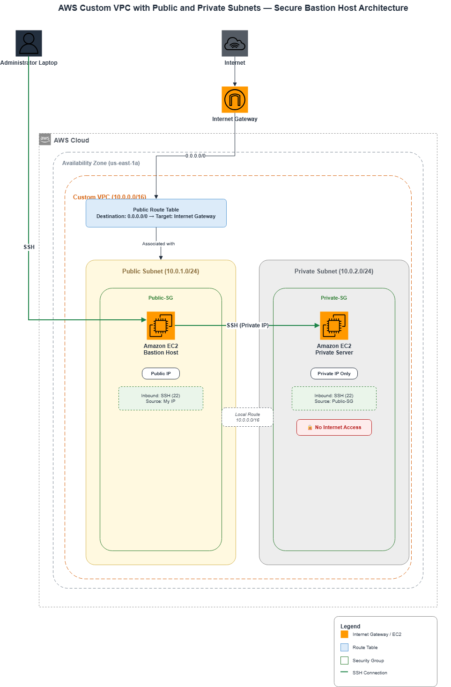
</p>

---

## Project Objectives

- Design a custom VPC from scratch.
- Create isolated public and private subnets.
- Configure an Internet Gateway and Route Tables.
- Deploy EC2 instances into different subnets.
- Secure the environment using Security Groups.
- Access a private EC2 instance through a Bastion Host.
- Demonstrate secure administrative access without exposing private resources to the internet.

---

## AWS Services Used

- Amazon VPC
- Amazon EC2
- Internet Gateway
- Route Tables
- Security Groups
- SSH

---

# Network Architecture

The network consists of:

- **Custom VPC** (`10.0.0.0/16`)
- **Public Subnet** (`10.0.1.0/24`)
- **Private Subnet** (`10.0.2.0/24`)
- Internet Gateway attached to the VPC
- Public Route Table
- Bastion Host (Public EC2)
- Private EC2 Instance

Only the Bastion Host has a public IP address.

The Private Server is accessible only through the Bastion Host using its private IP address.

---

# Security Design

This architecture follows the principle of least privilege.

### Bastion Host

- Deployed inside the Public Subnet
- Assigned a Public IPv4 address
- Accepts SSH connections from the administrator

### Private Server

- Deployed inside the Private Subnet
- No Public IPv4 address
- Accessible only from the Bastion Host

### Security Groups

**Public Security Group**

- Allow SSH (TCP 22)
- Source: Administrator IP

**Private Security Group**

- Allow SSH (TCP 22)
- Source: Public Security Group

This prevents direct SSH access from the internet to the Private Server.

---

# Deployment Steps

## 1. Create a Custom VPC

Created a custom VPC using CIDR block:

```
10.0.0.0/16
```

### Screenshot

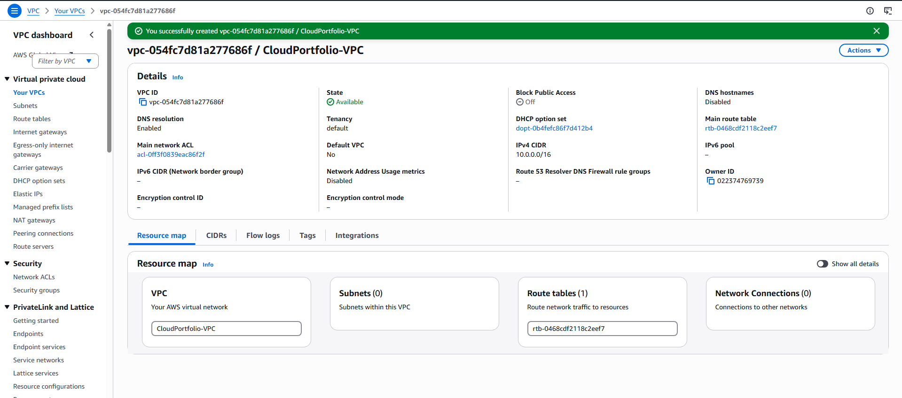

---

## 2. Configure Public and Private Subnets

Created two subnets:

- Public Subnet
- Private Subnet

### Screenshot

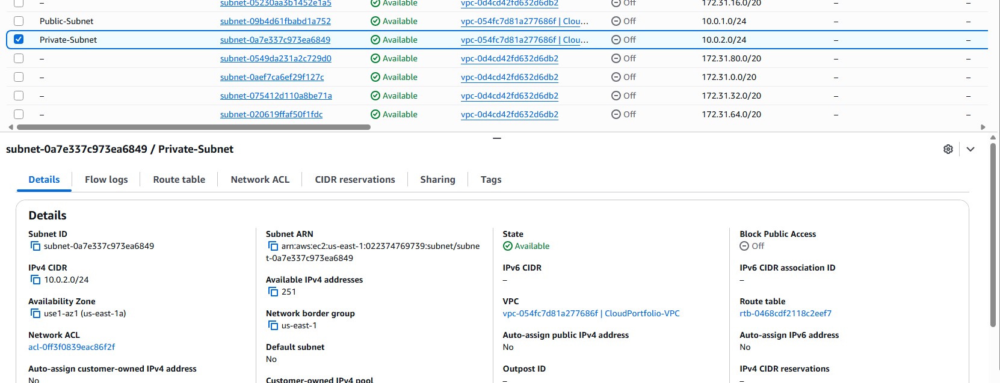

---

## 3. Attach Internet Gateway

Attached an Internet Gateway to enable internet connectivity for resources inside the public subnet.

### Screenshot

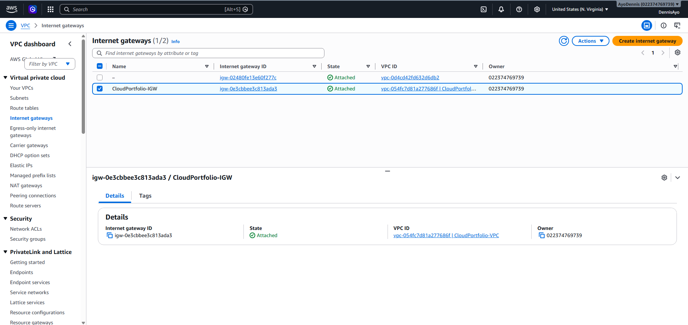

---

## 4. Configure Route Tables

Configured the Public Route Table with:

```
0.0.0.0/0 → Internet Gateway
```

### Screenshot

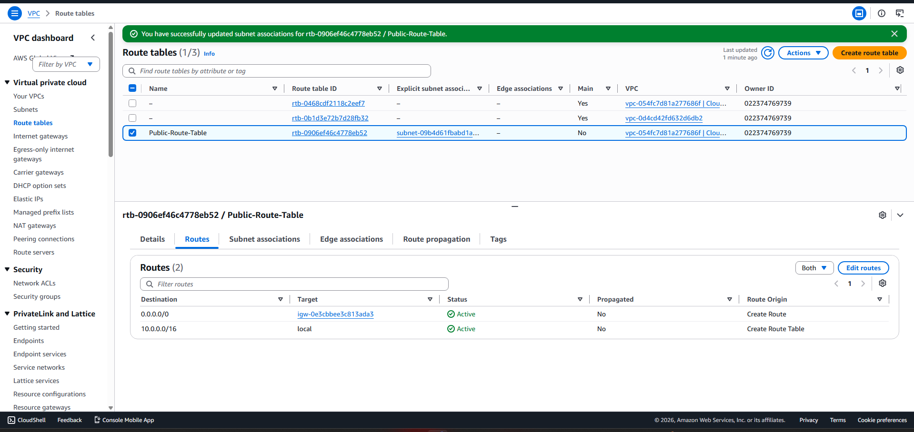

---

## 5. Configure Security Groups

Configured separate Security Groups for the Bastion Host and Private Server.

### Public Security Group

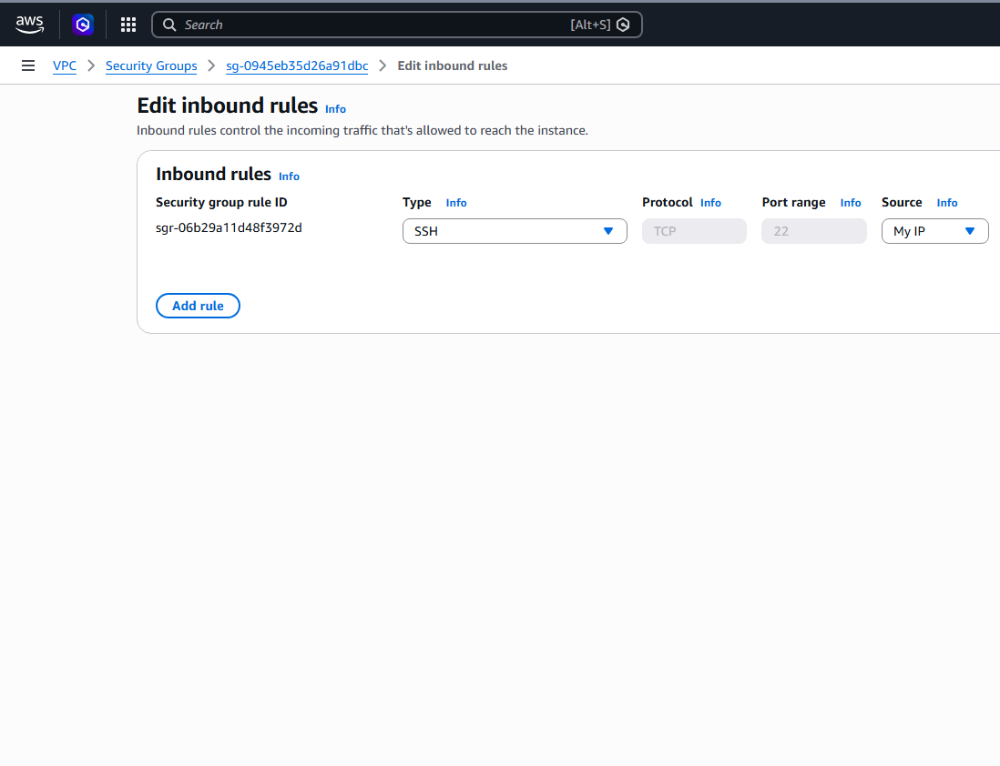

### Private Security Group

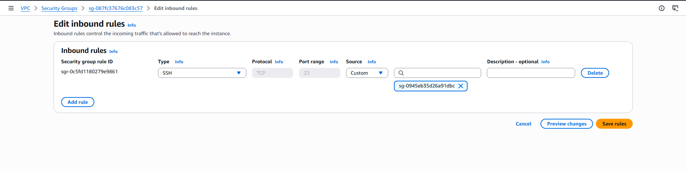

---

## 6. Launch EC2 Instances

Deployed two Ubuntu EC2 instances.

### Bastion Host

- Public Subnet
- Public IP Enabled

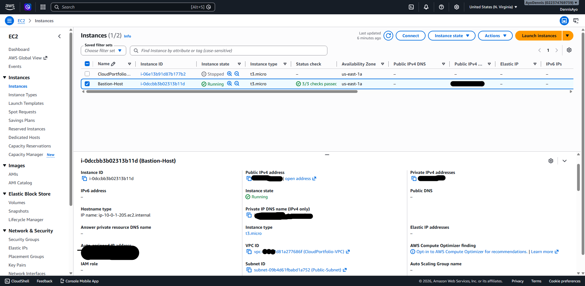

---

### Private Server

- Private Subnet
- No Public IP

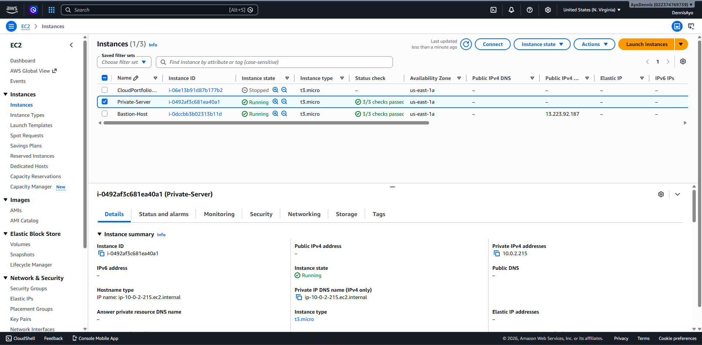

---

## 7. Verify Private Networking

Verified that the Private Server only has a private IP address.

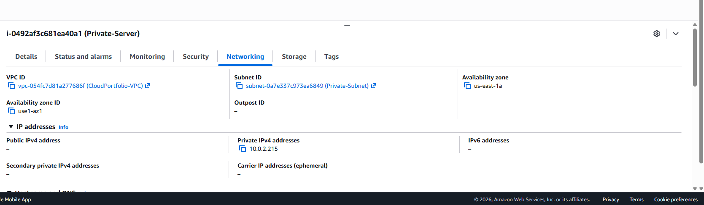

---

## 8. SSH to Bastion Host

Connected successfully to the Bastion Host using SSH.

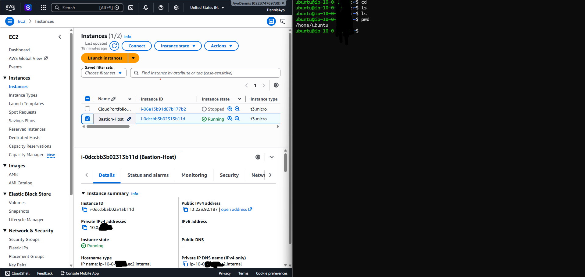

---

## 9. Access Private Server Through Bastion Host

Successfully connected from the Bastion Host to the Private Server using the server's private IP address.

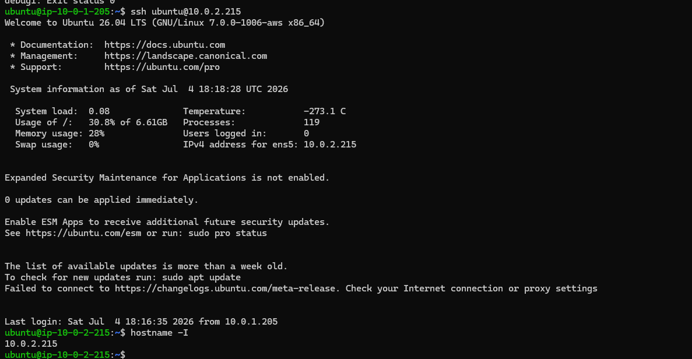

---

## 10. Verify Private Server Access

Confirmed successful login to the Private Server.

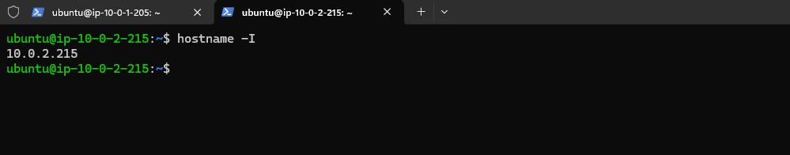

---

# Validation

The project successfully demonstrates:

- Custom VPC creation
- Public and Private subnet segmentation
- Internet Gateway configuration
- Route Table configuration
- Security Group implementation
- Bastion Host architecture
- Secure SSH access to a private EC2 instance
- Private infrastructure isolated from direct internet access

---

# Design Decisions

## Why use a Bastion Host?

Instead of assigning public IP addresses to every EC2 instance, only the Bastion Host is exposed to the internet.

This significantly reduces the attack surface while allowing administrators to securely manage resources located inside private subnets.

---

## Why separate Public and Private Subnets?

Separating workloads into public and private subnets improves security by preventing sensitive infrastructure from being directly reachable from the internet.

Only resources that require internet access are placed in the public subnet.

---

# Lessons Learned

During this project I gained practical experience with:

- Designing custom VPC architectures
- CIDR block planning
- Public vs Private subnet design
- Route Table configuration
- Internet Gateway deployment
- Security Group implementation
- SSH access through a Bastion Host
- AWS networking troubleshooting
- Secure infrastructure design

---

# Skills Demonstrated

- AWS Networking
- Amazon VPC
- Amazon EC2
- Internet Gateway
- Route Tables
- Security Groups
- SSH
- Linux Administration
- Cloud Infrastructure
- Network Security
- Infrastructure Documentation

---

# Future Improvements

Potential enhancements include:

- Deploy a NAT Gateway for secure outbound internet access from the Private Subnet.
- Replace SSH Bastion access with AWS Systems Manager Session Manager.
- Implement Network ACL customization.
- Add Application Load Balancer and Auto Scaling.
- Provision infrastructure using Terraform or AWS CloudFormation.

---

## Repository Structure

```
aws-custom-vpc-network
│
├── Architecture
│   ├── aws-custom-vpc-network.drawio
│   └── aws-custom-vpc-network.png
│
├── Screenshots
│   ├── Bastion-Terminal.png
│   ├── Bastion-host-instance.png
│   ├── Networking-of-private-server-instance.png
│   ├── Private-SG-rules.png
│   ├── Private-instance.png
│   ├── Private-subnet-config.png
│   ├── Public-SG-rules.png
│   ├── Route-configuration.png
│   ├── VPC-creation.png
│   ├── internet-gateway-attached.png
│   ├── private-server-terminal.png
│   └── ssh-from-public-to-private-server.png
│
├── LICENSE
├── README.md
└── .gitignore
```

---

## Author

**Dennis Owoju**

Final-Year Computer Engineering Student

Aspiring Cloud Engineer | AWS | Cybersecurity | Networking

---
